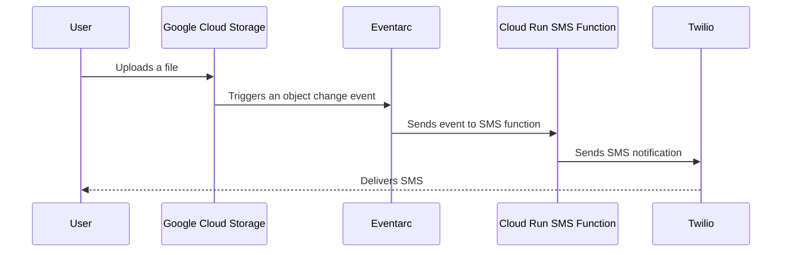

[](https://classroom.github.com/a/x94VxAg9)
# Sending SMS Text via Google Cloud Run Functions (2nd Generation)

In this assignment, you will learn how to send a text message using Google Cloud Functions when a new file is uploaded to a Cloud Storage bucket. This assignment demonstrates how to trigger an SMS notification through the Twilio API upon detecting file uploads in Google Cloud Storage.

**Prerequisites**: 
- A mobile phone number.
- A [free Twilio account](https://www.twilio.com/try-twilio) to obtain SMS capabilities.

## Architecture Overview

The following sequence diagram illustrates the event flow from file upload to SMS notification:



## Grading Rubric

| Criterion                        | Description                                                                              | Points |
|----------------------------------|------------------------------------------------------------------------------------------|--------|
| **Cloud Storage Bucket**         | Confirm that a Cloud Storage bucket is created and configured correctly.                  | 3      |
| **Eventarc Configuration**       | Ensure Eventarc is configured to trigger the Cloud Run function on storage events.       | 2      |
| **Cloud Run Function**           | Verify that the Cloud Run function is deployed, configured with environment variables, and interacts with the Twilio API. | 5      |

**Total**: 10 Points

### Required Screenshots and Logs

To receive full points for this lab, include the following in your submission:

- **Eventarc Configuration Screenshot**: Show the details of your Eventarc trigger configuration, confirming it detects changes in the Cloud Storage bucket and triggers the Cloud Run function.
- **Cloud Run Function Details Screenshot**: Capture the configuration details of your Cloud Run function, including environment variables and trigger settings.
- **Cloud Function Execution Logs**: Provide logs from a successful Cloud Function execution after uploading a test file to Cloud Storage. These logs should verify that the function ran as expected and interacted with the Twilio API.

Place these screenshots and logs in a folder called `submission` in your repository and submit the GitHub repository link to Canvas.

## Twilio Setup

1. **Sign Up**: Sign up for a Twilio account to receive test credits.
2. **Retrieve Test Credentials**:
   - Navigate to **Account** > **Keys & Credentials** > **Test API Keys and Tokens**.
   - Use the test number `+15005550006` as the SMS sender in your code.

## Cloud Run Function Tutorial

To configure this assignment’s components, follow the [Cloud Storage Trigger Tutorial](https://cloud.google.com/functions/docs/tutorials/storage#functions-prepare-environment-python) and the instructions below:
- The tutorial will guide you in setting up your Cloud Storage bucket, configuring the `Eventarc` trigger, and deploying the Cloud Run function.
- **Important**: Use the code provided in this repository, not the tutorial's code.
- **Environment Variables**: Deploy your Cloud Run function with the following environment variables set: `TWILIO_ACCOUNT_SID` and `TWILIO_AUTH_TOKEN`. Do not hardcode these values in your code.

## Testing

After deploying the function, test the setup by uploading a file to the Cloud Storage bucket and viewing logs to confirm function execution:

```shell
echo "Hello Cloud Computing" > test-finalize.txt
gcloud storage cp test-finalize.txt gs://YOUR_BUCKET_NAME/test-finalize.txt

# View the logs
gcloud functions logs read CLOUD_RUN_FUNCTION_NAME --region REGION --gen2 --limit=10
```

## Helpful Commands

### List Cloud Storage Buckets
To verify the existence of your Cloud Storage bucket:
```shell
gcloud storage ls --project YOUR_PROJECT_ID
```

### Verify IAM Policy Bindings
Ensure the GCP Storage service-agent has the necessary `roles/pubsub.serviceAgent` permissions:
```shell
# Get the storage service agent
gcloud storage service-agent
# Output format:
# service-PROJECT_ID@gs-project-accounts.iam.gserviceaccount.com

# Verify the service-agent's roles
gcloud projects get-iam-policy YOUR_PROJECT_ID
# Expected output snippet:
# - members:
#   - serviceAccount:service-PROJECT_ID@gs-project-accounts.iam.gserviceaccount.com
#   role: roles/pubsub.publisher
```

### List Cloud Run Functions

```shell
gcloud functions list --project YOUR_PROJECT_ID
```

### Deploy Your Function
Execute this command from the root of your project directory to deploy the function:
```shell
gcloud functions deploy sms_sender \
--gen2 \
--runtime="python311" \
--source . \
--entry-point="send_sms" \
--trigger-event-filters="type=google.cloud.storage.object.v1.finalized" \
--trigger-event-filters="CLOUD_STORAGE_BUCKET_NAME" \
--region="us-central1" \
--set-env-vars TWILIO_ACCOUNT_SID=your_account_sid,TWILIO_AUTH_TOKEN=your_auth_token
```
